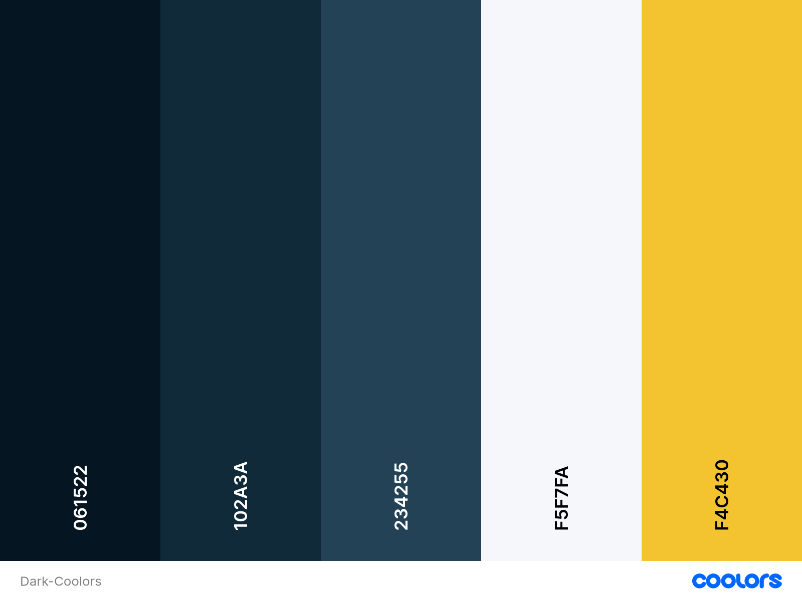
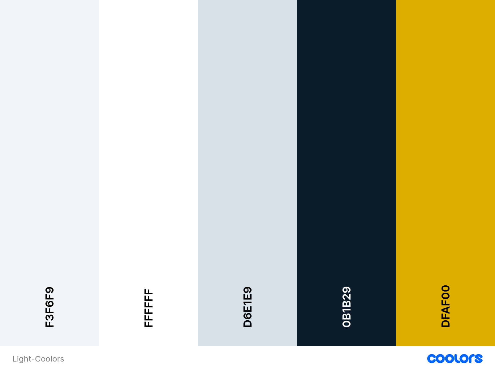
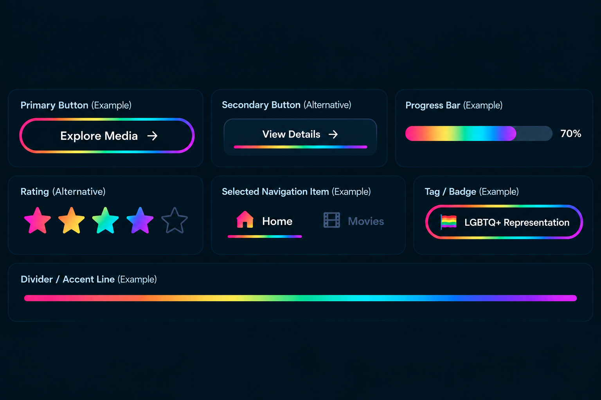
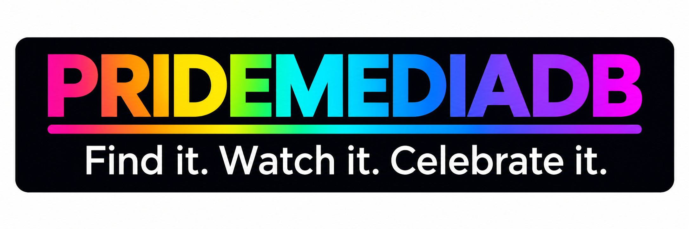
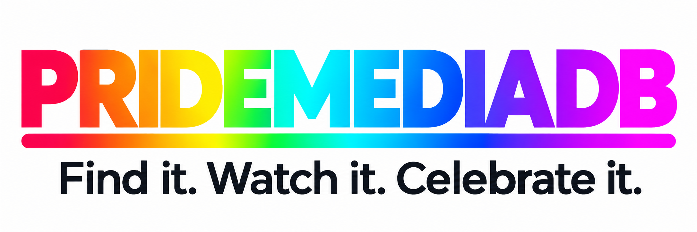
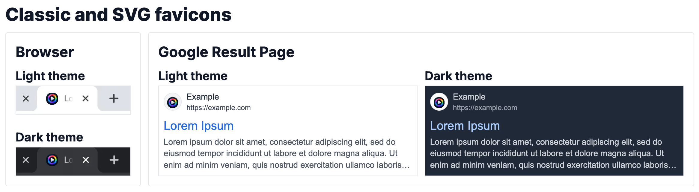
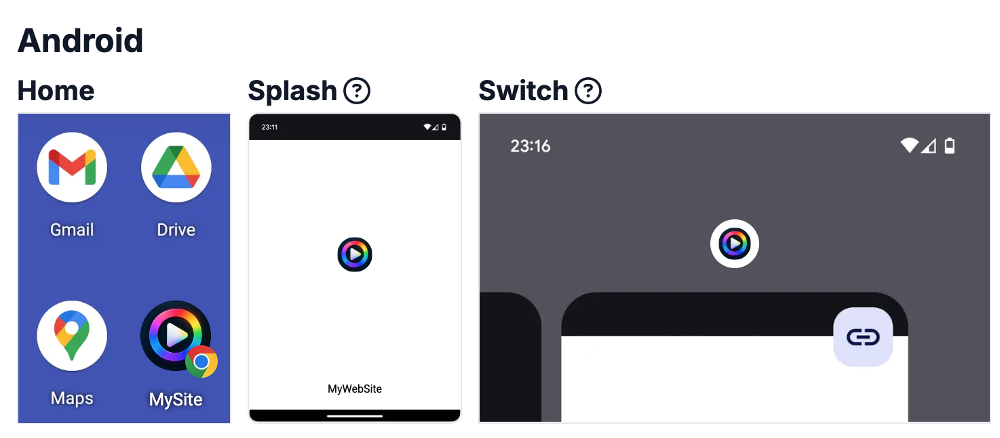
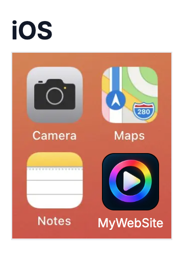

# PrideMediaDB

> **TODO:** Add responsive mock-up here

*Responsive mock-up of the completed PrideMediaDB application, demonstrating its responsive design across desktop, tablet and mobile devices.*

[Live Site](TODO) | [GitHub Repository](https://github.com/David-CB-UK/PrideMediaDB/)

---

## Table of Contents

1. [Project Overview](#project-overview)
2. [User Experience (UX)](#user-experience-ux)
   * [Project Purpose](#project-purpose)
   * [User Goals](#user-goals)
   * [User Goals and User Stories](#user-goals-and-user-stories)
   * [User Experience Goals](#user-experience-goals)
   * [Accessibility](#accessibility)
3. [Project Management](#project-management)
   * [Agile Development](#agile-development)
   * [GitHub Project Board](#github-project-board)
   * [Epics](#epics)
   * [User Stories and Acceptance Criteria](#user-stories-and-acceptance-criteria)
   * [MoSCoW Prioritisation](#moscow-prioritisation)
   * [Backlog Refinement](#backlog-refinement)
   * [Development Workflow](#development-workflow)
4. [Design](#design)
   * [Research and Design Inspiration](#research-and-design-inspiration)
   * [Visual Design](#visual-design)
   * [Colour Scheme](#colour-scheme)
   * [Typography](#typography)
   * [Logo and Branding](#logo-and-branding)
   * [Favicon & App Icons](#favicon--app-icons)
   * [Wireframes](#wireframes)
5. [Features](#features)
   * [Planned Features](#planned-features)
   * [Implemented Features](#implemented-features)
   * [Responsive Design](#responsive-design)
   * [User Authentication](#user-authentication)
   * [Film Discovery and Search](#film-discovery-and-search)
   * [Film Details and Representation](#film-details-and-representation)
   * [Ratings, Reviews and Watchlists](#ratings-reviews-and-watchlists)
6. [Database](#database)
   * [Database Design](#database-design)
   * [Entity Relationship Diagram](#entity-relationship-diagram)
   * [Django Models](#django-models)
7. [API Integration](#api-integration)
   * [API Research](#api-research)
   * [TMDb Integration](#tmdb-integration)
   * [API Feedback and Error Handling](#api-feedback-and-error-handling)
8. [Technologies Used](#technologies-used)
   * [Languages](#languages)
   * [Frameworks and Libraries](#frameworks-and-libraries)
   * [Database Technology](#database-technology)
   * [Development and Version Control](#development-and-version-control)
9. [Testing](#testing)
10. [Deployment](#deployment)
11. [Project Structure](#project-structure)
12. [Credits](#credits)
13. [References](#references)
14. [Acknowledgements](#acknowledgements)
15. [Future Development](#future-development)
16. [Reflections](#reflections)

---

## Project Overview

[Back to top](#pridemediadb)

---

## User Experience (UX)

[Back to top](#pridemediadb)

---

### Project Purpose

PrideMediaDB is being developed to provide a dedicated resource for discovering and exploring LGBTQ+ films and understanding the representation and context within them.

While existing film databases provide extensive general information about films, information relating specifically to LGBTQ+ representation, themes and context can be more difficult to find and is often spread across multiple sources. Research carried out during the planning of this project also identified gaps, duplicates, inconsistent categorisation and information requiring further verification within existing LGBTQ+ film resources.

PrideMediaDB aims to address this by providing a focused, structured database of LGBTQ+ film information, allowing users to discover films and explore information such as LGBTQ+ representation, themes, age ratings and other relevant details. External services can be used to complement this information rather than being recreated within the project.

Users will also be able to keep track of films they are interested in or have watched, rate and review films, contribute film suggestions, and share film information or their reviews with others who may be interested.

The project is designed to provide an accessible, responsive and engaging experience across desktop, tablet and mobile devices, with additional features and enhancements planned for future development.

[Back to top](#pridemediadb)

---

### User Goals

PrideMediaDB is designed around the following user goals:

- **Discover films** — Browse, search and filter the database to find LGBTQ+ films that match their interests.
- **Explore films and representation** — View detailed film information and explore LGBTQ+ representation, themes, categories, age ratings and other relevant information.
- **Explore additional film information** — Access relevant metadata and links to trusted external film information and ratings, including information provided through integrated external services.
- **Keep track of films** — Add films to a personal Watchlist and mark films as watched.
- **Rate and review films** — Create, view, edit and delete personal ratings and reviews to record and share opinions about films.
- **Contribute to the database** — Suggest films that may be missing from PrideMediaDB for consideration and approval.
- **Share film information** — Share individual film pages with others through social media or messaging services.
- **Use the application easily and accessibly** — Navigate and use PrideMediaDB effectively across desktop, tablet and mobile devices, including users with different accessibility needs.

These goals provide the foundation for the user stories and acceptance criteria used to plan and develop the project.

[Back to top](#pridemediadb)

---

### User Goals and User Stories

The user goals identified for PrideMediaDB are translated into user stories that describe what users need to accomplish and why. These stories provide the basis for the acceptance criteria used during development.

| User Goal | User Stories |
|---|---|
| **Discover films** | As a visitor, I want to browse and search the film database so that I can discover LGBTQ+ films that interest me. |
| **Explore films and representation** | As a visitor, I want to view detailed film information and LGBTQ+ representation so that I can understand what a film is about and how LGBTQ+ representation is presented. |
| **Explore additional film information** | As a visitor, I want to access relevant film metadata, external information and ratings so that I can explore information from additional trusted sources. |
| **Keep track of films** | As a registered user, I want to add films to my Watchlist and mark films as watched so that I can keep track of films I want to see and have already watched. |
| **Rate and review films** | As a registered user, I want to create, edit and delete my ratings and reviews so that I can record and share my opinions about films. |
| **Contribute to the database** | As a registered user, I want to suggest films that are missing from the database so that they can be considered for inclusion. |
| **Manage film suggestions** | As an administrator, I want to review and approve or reject suggested films so that only appropriate and relevant films are added to the database. |
| **Manage film data** | As an administrator, I want to add, edit and manage film information so that the database remains accurate and up to date. |
| **Share film information** | As a visitor, I want to share an individual film page so that I can recommend or discuss a film with others. |
| **Use the application easily and accessibly** | As a user, I want the application to be responsive, accessible and easy to navigate so that I can use it effectively across different devices and accessibility needs. |

The user stories are managed through the project's GitHub Issues and Project Board; [GitHub Issues](https://github.com/David-CB-UK/PrideMediaDB/issues). Acceptance criteria are used to define when each story has been completed.

[Back to top](#pridemediadb)

---

### User Experience Goals

[Back to top](#pridemediadb)

---

### Accessibility

[Back to top](#pridemediadb)

---

## Project Management

[Back to top](#pridemediadb)

---

### Agile Development

[Back to top](#pridemediadb)

---

### GitHub Project Board

[Back to top](#pridemediadb)

---

### Epics

[Back to top](#pridemediadb)

---

### User Stories and Acceptance Criteria

[Back to top](#pridemediadb)

---

### MoSCoW Prioritisation

[Back to top](#pridemediadb)

---

### Backlog Refinement

[Back to top](#pridemediadb)

---

### Development Workflow

[Back to top](#pridemediadb)

---

## Design

[Back to top](#pridemediadb)

---

### Research and Design Inspiration

[Back to top](#pridemediadb)

---

### Visual Design

[Back to top](#pridemediadb)

---

### Colour Scheme

The PrideMediaDB colour scheme is designed around a modern, cinematic interface for discovering and exploring LGBTQ+ film and media. The primary visual direction uses deep navy and blue-grey tones to create a strong dark interface, with a corresponding light theme using the same visual relationships and a neutral light background.

The **dark theme is the primary visual direction**, as it provides strong contrast with film imagery and allows the colourful PrideMediaDB branding to stand out. A light theme is also planned as a companion option to support **accessibility and user preference**. Providing a choice of theme allows users to select the viewing experience they find most comfortable, while both themes will maintain appropriate colour contrast and readability.

A limited core palette was selected to keep the interface visually consistent and avoid excessive use of colour. The two themes were developed using **[Coolors](https://coolors.co/)** and will be reviewed during implementation and accessibility testing.

#### Dark Theme

<strong>Dark Theme Colour Palette</strong> (Click to expand)

*Colour palette created using Coolors, illustrating the primary colours used throughout the PrideMediaDB dark theme.*

The dark theme uses deep navy and blue-grey tones as its foundation, with a warm yellow accent used for primary actions, ratings and selected interface highlights.

#### Light Theme

<strong>Light Theme Colour Palette</strong> (Click to expand)

*Colour palette created using Coolors, illustrating the primary colours used throughout the PrideMediaDB light theme.*

The light theme uses lighter neutral surfaces and dark navy text while retaining the same visual identity as the dark theme. It is intended as a companion theme rather than a separate colour scheme.

#### PrideMediaDB Rainbow Gradient

The PrideMediaDB rainbow gradient is a separate **brand treatment** rather than part of the core colour palette. It provides the distinctive rainbow identity of the project while allowing the main interface to remain visually controlled.

<strong>Rainbow Gradient Examples</strong> (Click to expand)

*Examples of the PrideMediaDB rainbow gradient applied to selected interface elements, including buttons, progress and rating bars, navigation highlights, badges and accent lines.*

 

The gradient will be implemented using CSS and reused consistently across selected elements, including the logo, progress and rating bars, and other visual highlights. The final gradient will use smooth transitions between rich rainbow tones rather than treating each colour as a separate block. Representation labels will use colours associated with their relevant Pride flags where appropriate, rather than using the general PrideMediaDB gradient for every category.

[Back to top](#pridemediadb)

---
### Typography

[Back to top](#pridemediadb)

---

### Logo and Branding

PrideMediaDB uses a distinctive rainbow-gradient wordmark to reflect the project's focus on LGBTQ+ film and media while maintaining a professional and contemporary visual identity.

The logo combines the PRIDEMEDIADB wordmark with the tagline "Find it. Watch it. Celebrate it." The gradient moves through a range of warm and cool rainbow tones, creating a consistent visual connection with the project's wider colour scheme.

The visual identity was developed from my own design ideas and refined through an iterative process using ChatGPT. ChatGPT was used to explore and develop visual concepts from my prompts and design requirements, with the final design decisions, colour choices and overall branding selected and reviewed by me.

The logo uses a transparent background to allow flexible placement within the application. Both light and dark backgrounds were considered during the design process; however, the logo has the strongest visual impact against a dark or black background, where the rainbow gradient and white tagline provide greater contrast and visual emphasis. The final interface will therefore use the logo primarily within the dark visual theme, while ensuring branding remains recognisable across the wider design system.

The logo has been provided in WebP format to reduce file size while maintaining visual quality and supporting website performance.

<strong>PrideMediaDB Logo</strong> (Click to expand)

### Dark background

### Light background

[Back to top](#pridemediadb)

---

#### Favicon & App Icons

The PrideMediaDB favicon and app icon uses a ring and play symbol as a simple and recognisable extension of the main brand identity. The rainbow treatment connects the icon to the wider PrideMediaDB visual design, while the simplified form allows it to remain clear at small sizes.

Multiple icon formats and sizes are used to support consistent branding across desktop browsers, search results and mobile devices.

<strong>Browser Favicon</strong> (Click to expand)

*PrideMediaDB favicon shown in browser tabs and Google search results in both light and dark themes.*

 

<strong>Android App Icons</strong> (Click to expand)

*PrideMediaDB icon shown in Android home-screen, splash-screen and app-switcher contexts.*

 

<strong>iOS App Icon</strong> (Click to expand)

*PrideMediaDB icon shown as an iOS home-screen app icon.*

 

**UX Rationale:**  
Using a consistent favicon and app icon across browsers and mobile devices helps users recognise PrideMediaDB quickly when browsing, switching between applications, bookmarking the site or adding it to a device home screen. The icon also maintains the visual connection between the main PrideMediaDB wordmark and the wider film/media branding.

[Back to top](#pridemediadb)

---

### Wireframes

[Back to top](#pridemediadb)

---

## Features

[Back to top](#pridemediadb)

---

### Planned Features

[Back to top](#pridemediadb)

---

### Implemented Features

[Back to top](#pridemediadb)

---

### Responsive Design

[Back to top](#pridemediadb)

---

### User Authentication

[Back to top](#pridemediadb)

---

### Film Discovery and Search

[Back to top](#pridemediadb)

---

### Film Details and Representation

[Back to top](#pridemediadb)

---

### Ratings, Reviews and Watchlists

[Back to top](#pridemediadb)

---

## Database

[Back to top](#pridemediadb)

---

### Database Design

[Back to top](#pridemediadb)

---

### Entity Relationship Diagram

[Back to top](#pridemediadb)

---

### Django Models

[Back to top](#pridemediadb)

---

## API Integration

[Back to top](#pridemediadb)

---

### API Research

[Back to top](#pridemediadb)

---

### TMDb Integration

[Back to top](#tmdb-integration)

---

### API Feedback and Error Handling

[Back to top](#pridemediadb)

---

## Technologies Used

[Back to top](#pridemediadb)

---

### Languages

[Back to top](#pridemediadb)

---

### Frameworks and Libraries

[Back to top](#pridemediadb)

---

### Database Technology

[Back to top](#pridemediadb)

---

### Development and Version Control

[Back to top](#pridemediadb)

---

## Testing

Details of the project's testing strategy, including automated testing and TDD, are documented in the separate Testing document.

[View Testing Documentation](docs/TESTING.md)

[Back to top](#pridemediadb)

---

## Deployment

[Back to top](#pridemediadb)

---

## Project Structure

[Back to top](#pridemediadb)

---

## Credits

[Back to top](#pridemediadb)

---

## References

[Back to top](#pridemediadb)

---

## Acknowledgements

[Back to top](#pridemediadb)

---

## Future Development

[Back to top](#pridemediadb)

---

## Reflections

[Back to top](#pridemediadb)
